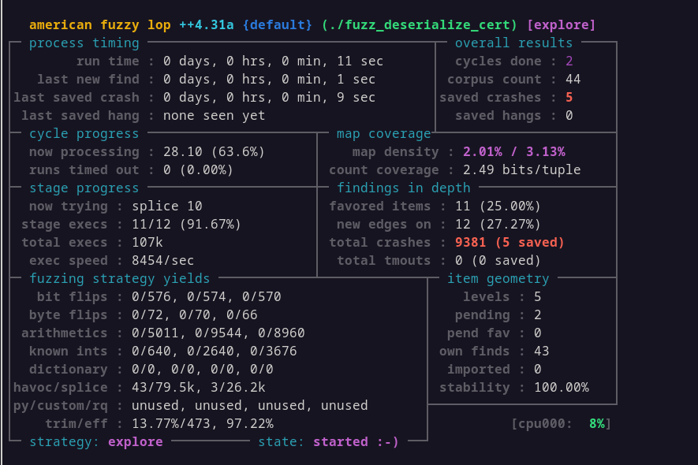

## Prerequisites
Install AFL++ (and it's pre-requisites such as clang)  
https://github.com/AFLplusplus/AFLplusplus/blob/stable/docs/INSTALL.md

## Building the harness
1. Run ``build_fuzzer.sh`` from the fuzz directory

## Running
1. Extract the corpus
```
tar -xvf deserialize_cert_corpus.tar.gz
```
2. Run the fuzzer  
``AFL_SKIP_CPUFREQ=1 afl-fuzz -i ./corpus -o ./output ./fuzz_deserialize_cert``
3. Wait for crashes to show up


IMPORTANT NOTE:
For an effective fuzzing campaign:
1. You'd orchestrate the fuzzing campaign with multiple cores
2. You'd run the fuzzer for several hours (if you do not get crashes in the meantime)
3. You'd omit AFL_SKIP_CPUFREQ and run the scripts to increase fuzzing performance
## Debugging crashes
To run all crashes:  
```find ./output/*/crashes/* -exec ./fuzz_deserialize_cert {} \;```
